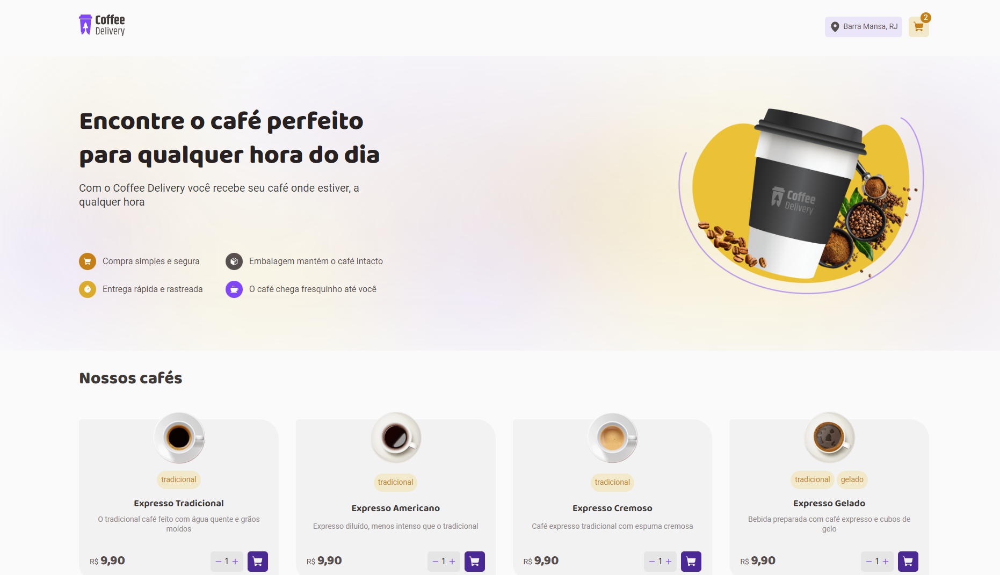

<h1 align="center"> Coffe Delivery </h1>

  Voce pode encontrar demo do projeto no github pages nesse <a href="https://lupebreak.github.io/coffee-delivery/">Link</a> ( TO DO )

  <a href="#-tecnologias">Tecnologias</a>&nbsp;&nbsp;&nbsp;|&nbsp;&nbsp;&nbsp;
  <a href="#-projeto">Projeto</a>&nbsp;&nbsp;&nbsp;|&nbsp;&nbsp;&nbsp;
  <a href="#memo-licença">Licença</a>

  

 

  

## 🚀 Tecnologias

Esse projeto foi desenvolvido com as seguintes tecnologias:

- Vite
- Typescript
- React
- Styled Components
- Git e Github

## 💻 Projeto

O Coffe Delivery é um delivery ecommerce simplificado de uma cafeteria com pagamentos na entrega. Podendo ser facilmente adaptado para outros produtos necessitando apenas de poucas alteraçoes. Desenvolvido com react e typescript, esse projeto foi criado como um desafio seguindo um design do figma.

## :memo: Licença

Esse projeto está sob a licença MIT.

---

Feito com ♥ by [LuPeBreak](https://github.com/LuPeBreak/) como um desafio do Ignite ReactJS da [RocketSeat](https://www.rocketseat.com.br/) utilizando o [design do figma](https://www.figma.com/file/5yT9ZzZmRQRS4yivGGB3pl/Coffee-Delivery/duplicate) como objetivo sem qualquer tutorial.
